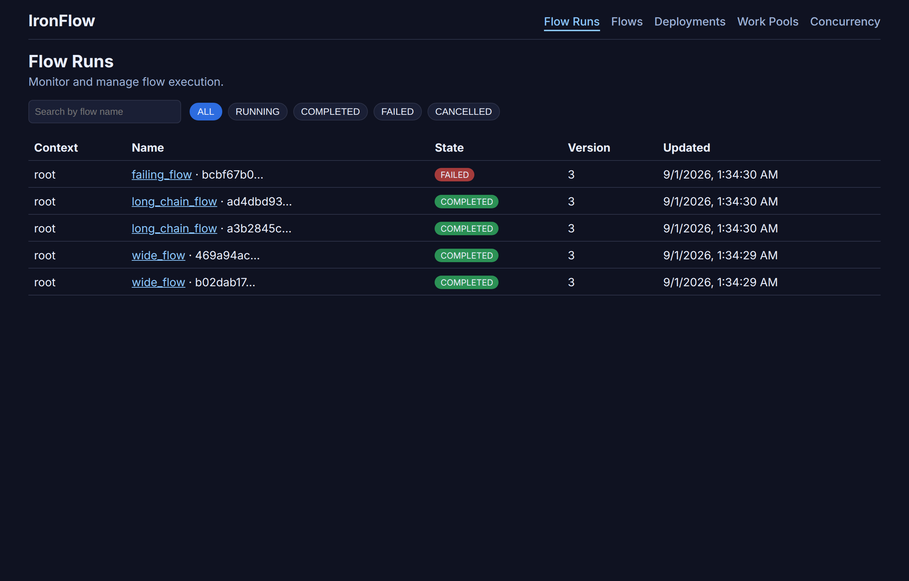
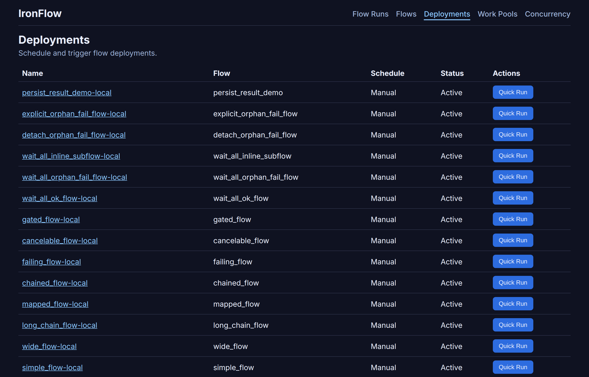

# IronFlow

[](https://github.com/PPPSDavid/rust-based-prefect/actions/workflows/ci.yml)
[](https://github.com/PPPSDavid/rust-based-prefect/actions/workflows/docs.yml)
[](https://pypi.org/project/ironflow-prefect-compat/)
[](https://github.com/PPPSDavid/rust-based-prefect/releases)
[](LICENSE)

Prefect-style `@flow` / `@task` workflows in Python, with a **Rust** orchestration kernel for deterministic state and durable history.

Write flows the way you already know. IronFlow runs them **in-process** (no server required) and optionally serves a local API and UI so you can inspect runs, logs, and DAGs.

> **Subset, not a drop-in.** Import **`prefect_compat`**, not `prefect`. See the [compatibility matrix](https://pppsdavid.github.io/rust-based-prefect/compatibility/) for what is supported vs Prefect OSS 3.x. This is an independent prototype, not an official Prefect distribution.

## Highlights

- **Familiar authoring** — `@flow`, `@task`, `submit()`, `map()`, retries, deployments, and a CLI (`ironflow deploy` / `serve`).
- **Rust control plane** — state machine, transition validation, and append-only history live in `rust-engine/`; Python stays a thin compatibility and I/O bridge.
- **In-process first** — orchestration runs without an API. The HTTP server and Vite UI are optional.
- **Local UI** — flow runs, logs, artifacts, and a **DAG + static forecast** view (aggregated fan-out vs per-task-run).
- **Control-plane throughput** — on the synthetic in-repo A/B harness, in-process IronFlow is typically **two to three orders of magnitude** more transitions/s than local Prefect OSS on comparable toy flows. Task bodies (I/O, ML, ETL) are unchanged; read the [performance caveats](https://pppsdavid.github.io/rust-based-prefect/PERFORMANCE_OVERVIEW/).

## Install

The published package is **[`ironflow-prefect-compat`](https://pypi.org/project/ironflow-prefect-compat/)**. On supported platforms, **prebuilt wheels include the Rust engine** — no Rust toolchain required. Use **CPython 3.11 or 3.12**.

```bash
pip install ironflow-prefect-compat
```

```bash
uv pip install ironflow-prefect-compat
```

Quick check (expect `True` when a matching wheel loaded):

```bash
python -c "from prefect_compat.rust_bridge import native_library_available; print(native_library_available())"
```

## Hello, flow

Save as `hello_ironflow.py` and run `python hello_ironflow.py`:

```python
from prefect_compat import InMemoryControlPlane, flow, set_control_plane, task


@task
def add_one(n: int) -> int:
    return n + 1


@flow
def hello(n: int = 1) -> int:
    return add_one.submit(n).result()


if __name__ == "__main__":
    set_control_plane(InMemoryControlPlane())
    print(hello(5))  # 6
```

A slightly richer `submit` / `map` example (no clone) is in the [PyPI quick start](https://pppsdavid.github.io/rust-based-prefect/QUICKSTART_PYPI/). Platform notes, sdist fallbacks, and git checkout: [Installation](https://pppsdavid.github.io/rust-based-prefect/INSTALL/).

## See it in the UI

Start the local API + dashboard, seed a few runs, then open **[http://localhost:4173](http://localhost:4173)** (use `localhost`, not `127.0.0.1`):

```bash
python scripts/ironflow_server.py start
python scripts/ui_e2e_seed.py
```

<video src="docs/assets/readme/ui-run-dag.mp4" width="900" autoplay loop muted playsinline>
  
</video>





Need a clone first? Follow [Installation](https://pppsdavid.github.io/rust-based-prefect/INSTALL/) §2–5, then [How to run the server and UI](https://pppsdavid.github.io/rust-based-prefect/how-to/server-and-ui/).

## Where to go next

| | |
| --- | --- |
| **Docs** | [Hosted docs](https://pppsdavid.github.io/rust-based-prefect/) · [Install](https://pppsdavid.github.io/rust-based-prefect/INSTALL/) · [First deployment](https://pppsdavid.github.io/rust-based-prefect/quickstart-first-deployment/) |
| **Prefect users** | [Prefect → IronFlow](https://pppsdavid.github.io/rust-based-prefect/PREFECT_IRONFLOW_MAPPING/) · [Compatibility](https://pppsdavid.github.io/rust-based-prefect/compatibility/) |
| **Self-hosted** | [Server](https://pppsdavid.github.io/rust-based-prefect/SELF_HOSTED_SERVER/) · [Docker](https://pppsdavid.github.io/rust-based-prefect/how-to/docker-quickstart/) · [Compose](https://pppsdavid.github.io/rust-based-prefect/how-to/docker-compose/) |
| **Internals** | [Architecture](https://pppsdavid.github.io/rust-based-prefect/architecture/) · [Performance](https://pppsdavid.github.io/rust-based-prefect/PERFORMANCE_OVERVIEW/) |

## Develop from source

Clone, `uv sync --group dev`, and `cargo build --manifest-path rust-engine/Cargo.toml`. Tests, lint, docs, and benchmarks: **[CONTRIBUTING.md](CONTRIBUTING.md)**. Agent / Cloud validation: **[AGENTS.md](AGENTS.md)**.

## License

**Apache-2.0** — see [LICENSE](LICENSE).
