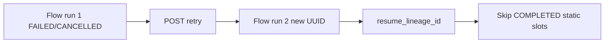
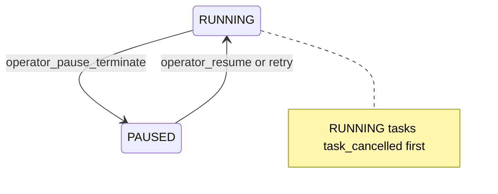

# State transition matrix

Authoritative catalog of IronFlow flow-run and task-run state transitions. The Rust engine enforces the base FSM; the Python control plane adds lifecycle-specific `transition_kind` labels and API guards.

See also: [States and transitions](states-and-transitions.md), [Execution contract](execution-contract.md), [How to choose graph mode and retry](../how-to/graph-mode-and-retry.md).

## Base FSM (`RunState`)

Shared by flow runs and task runs. Source: `validate_transition` in `rust-engine/src/engine.rs`.

| From | Allowed to |
| --- | --- |
| `SCHEDULED` | `PENDING`, `CANCELLED` |
| `PENDING` | `RUNNING`, `CANCELLED` |
| `RUNNING` | `COMPLETED`, `FAILED`, `CANCELLED`, `PAUSED` |
| `PAUSED` | `RUNNING`, `CANCELLED` |
| `COMPLETED`, `FAILED`, `CANCELLED` | *(none — terminal)* |

**IronFlow invariants:**

- Self-transitions are invalid.
- Terminals are **strict** — no `COMPLETED→RUNNING`. Flow retry creates a **new** flow run instead of re-opening terminals.
- Duplicate transition tokens are idempotent (`TransitionStatus::Duplicate`).

### Unsupported transitions (by design)

| Transition | Recovery path |
| --- | --- |
| `COMPLETED→RUNNING` | New flow run + resume skip (effective-static only) |
| `FAILED→RUNNING` in-place | Deployment retry API → new flow run |
| `CANCELLED→*` | Terminal — use retry for a new attempt |
| Task `PAUSED` | Not used; gate/operator pause is flow-level |

## Flow transition kinds

| `transition_kind` | FSM edge | Notes |
| --- | --- | --- |
| `propose` | `SCHEDULED→PENDING` | Flow registered |
| `start` | `PENDING→RUNNING` | Often batched with `propose` |
| `complete` | `RUNNING→COMPLETED` | Body finished; `@flow(final_state="wait_all")` may defer via child fold |
| `user_cancel` | `*→CANCELLED` | Cancel API; terminate lifecycle |
| `operator_pause_drain` | `RUNNING→PAUSED` | Blocks new submits; settles when drained |
| `operator_pause_terminate` | `RUNNING→PAUSED` | RUNNING tasks → `task_cancelled` first |
| `operator_resume` | `PAUSED→RUNNING` | Operator pause only (not gate-only `PAUSED`) |
| `gate_wait` | `RUNNING→PAUSED` | Temporal gate |
| `gate_open` | `PAUSED→RUNNING` | Gate promotion |
| `superseded_by_terminate_resume` | `*→CANCELLED` | Prior in-process attempt terminalized |

### API guards (above FSM)

- `pause_flow_run`: only from `SCHEDULED|PENDING|RUNNING`; rejects gate-only `PAUSED`.
- `resume_flow_run`: operator pause only.
- `retry_flow_run`: deployment-backed; creates new flow run with `resume_from_flow_run_id`.

## Task transition kinds

| Event / `transition_kind` | FSM edge |
| --- | --- |
| `task_pending` | `SCHEDULED→PENDING` |
| `task_running` | `PENDING→RUNNING` |
| `task_completed` | `RUNNING→COMPLETED` |
| `task_failed` | `RUNNING→FAILED` |
| `task_cancelled` | non-terminal → `CANCELLED` |

**Fencing:** `CANCELLED` task rows reject late `task_completed`, `task_running`, `task_pending`.

## Flow terminal resolution (separate from FSM)

When `@flow(final_state="wait_all")`, Rust `fold_terminal_state` aggregates contributing child task states:

**Priority:** `CANCELLED` > `FAILED` > incomplete children → `FAILED` > `COMPLETED`.

Detached tasks (`contribute_to_flow_state=False`) are excluded.

## Lifecycle diagrams

### Happy path

### Deployment retry (static effective mode)

### Operator terminate pause

## Concurrent-state invariants

Proven by `pytest -m airtight` (not `perf_matrix`):

- Duplicate tokens → one `applied`.
- Parallel flows → legal terminals only.
- Late `task_completed` after cancel stays `CANCELLED`.
- `wait_all`: FAILED child cannot yield COMPLETED flow.

See [airtight-concurrency plan](../plans/airtight-concurrency.md).
