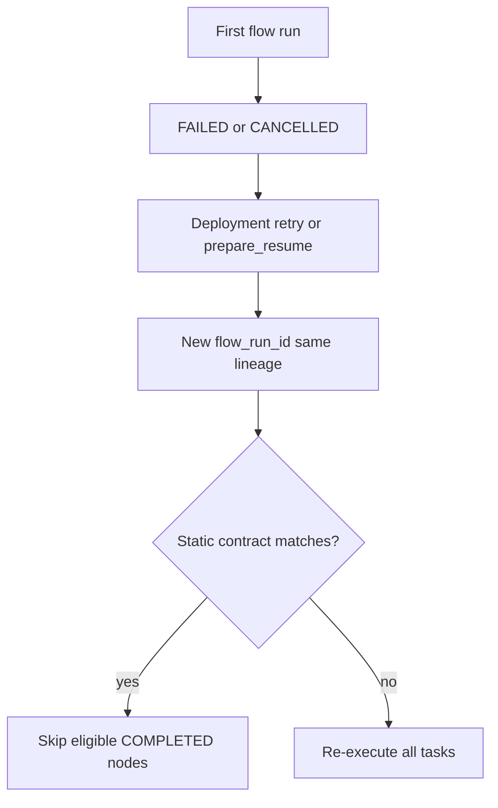

# How to choose graph mode and retry

IronFlow classifies each flow run as **static** or **dynamic** for resume behavior. This guide explains the three modes, when to override defaults, and how retry interacts with Prefect.

Normative rules: **[Execution contract](../concepts/execution-contract.md)**. Resume skip details: **[Task resume and persist](task-resume-and-persist.md)**. Prefect comparison: **[Prefect → IronFlow](../PREFECT_IRONFLOW_MAPPING.md)** § State & retry identity.

## Quick reference

| `graph_mode` | Effective when | Resume skips on retry |
| --- | --- | --- |
| **`auto`** (default) | Planner: clean manifest → static; else dynamic | Only when effective=static and contract matches |
| **`static`** | Planner agrees (no fallback) | Yes when contract matches; fail if runtime diverges |
| **`dynamic`** | Always dynamic | **Never** |

## Examples

### Default auto — static submit chain

```python
@flow
def pipeline(x: int = 1) -> int:
    a = expensive.submit(x)
    return add_one.submit(a).result()
```

Planner sees a linear `submit` chain → **effective=static**. On deployment retry with same parameters, persisted/`None` nodes may skip.

### Auto → dynamic — conditional body

```python
@flow
def pipeline(flag: bool) -> None:
    if flag:
        a.submit()
    else:
        b.submit()
```

Planner sets `fallback_required=true` → **effective=dynamic**. Retry always re-runs all tasks.

### Force static — fail fast if wrong

```python
@flow(graph_mode="static")
def pipeline() -> int:
    return work.submit(1).result()
```

If the body later gains dynamic control flow, the flow **fails at start** instead of mis-skipping on retry.

### Force dynamic — no skips even when planner is clean

```python
@flow(graph_mode="dynamic")
def pipeline() -> int:
    return work.submit(1).result()
```

Use when runtime behavior differs from static analysis (hidden branches, external side effects) or when you want predictable full re-execution.

## Retry flow (static effective)



Identity for skips: `(resume_lineage_id, planned_node_id, map_index, input_fingerprint)` — not `task_run_id`.

## Attempt counters

| Field | Meaning |
| --- | --- |
| `flow_attempt_number` | 1 on first run in lineage; increments on each retry |
| `task_run_attempt` | 1 per task run row today; future in-run task retries will increment |

Expose via `GET /api/flow-runs/{id}` and task run listings.

## Prefect comparison (summary)

| Topic | Prefect 3.x | IronFlow |
| --- | --- | --- |
| Flow retry identity | Often **same** `flow_run_id`, new task rows | **New** `flow_run_id`, lineage via `resume_from_flow_run_id` |
| Task retry identity | **Same** `task_run_id`, `run_count++` | **Not implemented** — see `docs/plans/task-auto-retry.md` |
| Skip on retry | Cache / persist policies | Static contract + logical DAG slot only |
| Dynamic flows | All flows potentially dynamic | **`auto`** detects; **`dynamic`** forces fresh retry |

## Related

- **[State transition matrix](../concepts/state-transition-matrix.md)** — FSM edges and transition kinds
- **[Compatibility matrix](../compatibility.md)** — supported subset
- **[Port from Prefect](port-from-prefect.md)** — migration checklist
