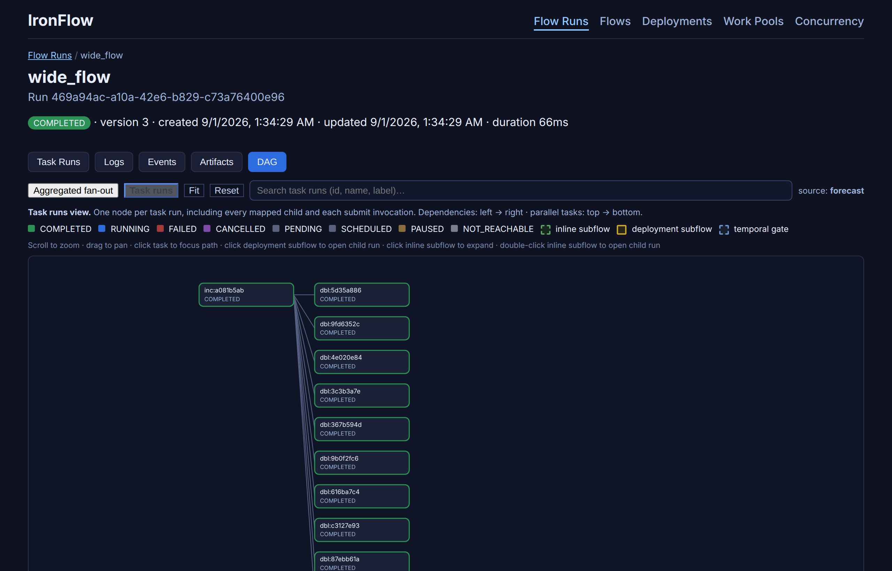

# Project IronFlow

Prefect-style `@flow` / `@task` workflows in Python, with a **Rust** orchestration kernel for deterministic state and durable history. Write flows the way you already know; IronFlow runs them **in-process** (no server required) and optionally serves a local API and UI so you can inspect runs, logs, and DAGs.

> **Subset, not a drop-in.** Import **`prefect_compat`**, not `prefect`. See the [compatibility matrix](compatibility.md) for what is supported vs Prefect OSS 3.x.

## Choose your path

| Goal | Where to start |
| --- | --- |
| **Install from PyPI and run a flow (no clone)** | **[Quick start: PyPI](QUICKSTART_PYPI.md)** after **[Installation](INSTALL.md)** |
| **First deployment with the CLI** | **[Quickstart: first deployment](quickstart-first-deployment.md)** |
| Self-hosted API, workers, deployments | **[Self-hosted server](SELF_HOSTED_SERVER.md)** |
| Understand flows, tasks, runners, and states | **[Concepts overview](concepts/index.md)** |
| Nest flows (inline or deployment-backed subflows) | **[How to compose flows with subflows](how-to/subflows.md)** |
| Do something specific (setup, server, porting) | **[How-to guides](how-to/index.md)** |
| Supported features vs Prefect | **[Compatibility matrix](compatibility.md)** |
| Performance expectations | **[Performance (vs Prefect)](PERFORMANCE_OVERVIEW.md)** |

## Step-by-step onboarding

**PyPI users (recommended):**

1. **[Install IronFlow](INSTALL.md)** — `pip install ironflow-prefect-compat` or `uv pip install ironflow-prefect-compat`.
2. **[Quick start: PyPI](QUICKSTART_PYPI.md)** — copy-paste a tiny flow; no server required.
3. **[Quickstart: first deployment](quickstart-first-deployment.md)** — start the API, `ironflow init`, `ironflow deploy`, trigger a run.
4. **[Self-hosted server](SELF_HOSTED_SERVER.md)** — workers, schedules, split-process setups.

**Repository developers:**

1. **[Installation](INSTALL.md)** §2–5 — clone, environment, `cargo build`.
2. **[Quick start (demo flow)](QUICKSTART_DEMO.md)** — bundled `flow_ironflow.py` example.
3. **[How to run the server and UI](how-to/server-and-ui.md)** — optional API + Vite UI.

For performance expectations, see **[Performance (vs Prefect)](PERFORMANCE_OVERVIEW.md)**. Clone, tests, lint, and benchmarks: repository **[CONTRIBUTING.md](https://github.com/PPPSDavid/rust-based-prefect/blob/main/CONTRIBUTING.md)**.

## AI assistants and agents

- **Documentation index:** [`llms.txt`](https://pppsdavid.github.io/rust-based-prefect/llms.txt) on the built site — sitemap with one-line descriptions and GitHub markdown links.
- **Markdown source:** edit pages under `docs/` in the [repository](https://github.com/PPPSDavid/rust-based-prefect/tree/main/docs).
- **Contributor/agent workflow:** [AGENTS.md](https://github.com/PPPSDavid/rust-based-prefect/blob/main/AGENTS.md) (not published here; maintainer-oriented).

## Prefect (upstream)

IronFlow echoes Prefect 3.x patterns but implements a **subset** with different internals. For the upstream mental model (flows, tasks, deployments in Prefect’s world), use the official docs:

- [Prefect 3 — Get started](https://docs.prefect.io/v3/get-started)
- [Prefect 3 — Concepts](https://docs.prefect.io/v3/concepts)
- [Prefect 3 — How-to guides](https://docs.prefect.io/v3/how-to-guides)
- [Prefect llms.txt](https://docs.prefect.io/llms.txt) — AI-friendly sitemap (IronFlow provides a similar `llms.txt`).

Read Prefect for general orchestration ideas; read **[Prefect → IronFlow](PREFECT_IRONFLOW_MAPPING.md)** and **[Compatibility](compatibility.md)** for what this repository actually implements.
