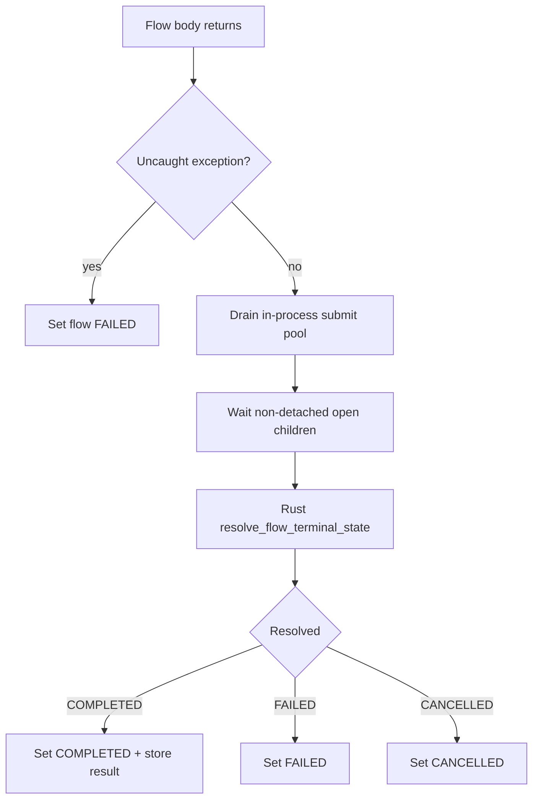

# Flow-run final state from task / subflow states

**Status:** Proposed (design only — not implemented)  
**Last updated:** 2026-07-14  
**Scope (when implemented):** `rust-engine/` (aggregation), `python-shim/` (`@flow` completion barrier), docs (`COMPATIBILITY.md`, concepts)  
**Forbidden on first slice:** Prefect `State` return-object parity, full CRASHED taxonomy, benchmark methodology changes  

This plan rationalizes how a **flow run** terminal state should be derived from its **task runs** and **child flow runs**, and where IronFlow intentionally diverges from Prefect 3.x.

User-facing docs after implement: update [Flows](../concepts/flows.md), [Compatibility matrix](../../COMPATIBILITY.md), [Prefect → IronFlow](../PREFECT_IRONFLOW_MAPPING.md). Subflow fire-and-forget notes in [How to compose flows with subflows](../how-to/subflows.md).

---

## 1. Why Prefect’s model feels heavy

Prefect’s [final state determination](https://docs.prefect.io/v3/concepts/states#final-state-determination) is **return-value driven**:

| Flow body outcome | Flow run terminal state |
| --- | --- |
| Exception raised in the flow function | `FAILED` |
| Returns a manually constructed `State` | That state |
| Returns an iterable of `State`s | `FAILED` if any is failed; else success path |
| Returns anything else / `None` without error | `COMPLETED` |

Important consequence: **a failed task does not fail the flow** unless the flow code raises, returns that failed state, or returns a collection that includes it. Typical patterns then force authors to:

- call `.result()` / `wait(...)` on every future they care about, or
- thread `return_state=True` and manually inspect / return states, or
- accept “green flow, red tasks” as normal.

For ~99% of IronFlow workloads, the desired invariant is simpler:

> **A flow run is `COMPLETED` only when every counted child work item under that run completed successfully.**

That matches dashboard intuition, static forecasts (“all planned nodes done”), and deterministic control-plane reasoning. IronFlow’s goals (determinism, performance, predictability) justify **not** copying Prefect’s return-value / `State`-object rules as the default.

---

## 2. What IronFlow does today

Authoritative path: `python-shim/src/prefect_compat/decorators.py` (`@flow` wrapper).

1. Create flow run → `PENDING` → `RUNNING`.
2. Execute the flow function.
3. `_drain_submit_executor(...)` — for concurrent `ThreadPoolTaskRunner`, wait until outstanding submit bodies finish (**does not re-raise** worker exceptions).
4. If not cancelled and no exception escaped the flow body → set flow `COMPLETED` and store the Python return value.
5. If an exception escapes → set flow `FAILED` and re-raise.
6. Cancellation → `CANCELLED`.

There is **no** aggregation of task-run states into the flow terminal state. Existing `_aggregate_state` in `runtime.py` is only for **DAG UI node collapse** (logical mode), not flow-run completion.

Implications (intentional today for subflows, accidental for tasks):

| Scenario | Flow result today |
| --- | --- |
| Task fails, caller does `fut.result()` / `wait` | Exception → flow `FAILED` (unless caught) |
| Concurrent `submit` fails, never observed | Task `FAILED`, flow often still `COMPLETED` after pool drain |
| `deployment_ref(...).submit()` fire-and-forget | Parent can `COMPLETED` while child still scheduled/running (documented) |
| Inline `child_flow(...)` | Parent blocks; child terminal already known before parent returns |

Prefect-like `return Failed(...)` / iterable-of-states finalization is **not** implemented (and should stay out of the default path).

---

## 3. Decision protocol summary

Three viewpoints (compat author UX, engine determinism, API surface) reached consensus:

1. **Default = aggregate all counted child work** toward the flow terminal state (not Prefect return-value rules).
2. **Keep a narrow escape hatch** for true fire-and-forget / safe-to-fail work (flow-level mode and/or per-submit detach).
3. **Own the resolution function in Rust** over the persisted task-/child-run rows; Python only chooses *when* to call it and *which* mode applies. Do not inspect Python return values for `State` objects on the hot path.

---

## 4. Proposed model

### 4.1 Completion modes on `@flow`

```python
@flow                                  # final_state="wait_all" (default)
def pipeline(...): ...

@flow(final_state="explicit")          # rare: body return/exception is authoritative
def notifier(...): ...
```

| Mode | Meaning |
| --- | --- |
| **`wait_all` (default)** | After the body returns without an uncaught exception: (1) finish/drain in-process submissions; (2) wait for any still-open **non-detached** child work owned by this flow run; (3) **resolve** terminal state from those child states. Body return value is still stored as the flow result payload when the resolved state is `COMPLETED`. |
| **`explicit`** | Preserve today’s semantics: body return without exception → `COMPLETED` (after in-process drain only); body exception → `FAILED`. Open deployment-backed fire-and-forget children are allowed. Unobserved failed in-process tasks still land as task `FAILED` without forcing flow failure unless the exception is observed on the coordinating thread. |

Name bikeshed acceptable alternatives: `completion_policy`, `resolve_state`. Prefer **`final_state`** only if it stays a small enum string, not a Prefect `State` object.

### 4.2 Per-work opt-out (recommended alongside the flow toggle)

Flow-level `explicit` is coarse. Mixed pipelines need both “must succeed” and “safe to fail”:

```python
# proposed authoring surface (names TBD)
noisy.submit(..., detach=True)
deployment_ref("ping").submit(..., detach=True)
```

**Detached** work:

- Still creates task / subflow / deployment runs (visible in UI).
- Is **excluded** from the parent’s `wait_all` wait set and aggregation input.
- Cancel propagation policy for detached deployment children: **follow parent cancel by default** (same as today for active M2 children); document if we later add `detach(..., cancel_with_parent=False)`.

Prefer **opt-out detach** over inventing Prefect `return_state` collection for the common path.

### 4.3 Resolution function (normative)

Inputs: multiset of states for **counted** children of flow run `F`.

Counted children under `wait_all`:

- All `task_runs` with `flow_run_id = F` and `kind in {task, gate, subflow}` where not detached.
- For `kind=subflow`, the mirrored parent-task state already reflects child deployment/flow success/failure once waited; until then the parent must **block** on the child reaching a terminal status (reuse existing `wait_for_deployment_run_terminal` / future `.result()` path under the hood).
- Inline child flow runs (`execution_mode=inline`) are already terminal when the call returns; no extra wait. Optionally include their rows in the check for defense-in-depth.

**Priority (first match wins):**

1. Any `CANCELLED` → flow `CANCELLED`
2. Any `FAILED` (and later `CRASHED` / `TIMED_OUT` if introduced) → flow `FAILED`
3. Any non-terminal (`PENDING`, `SCHEDULED`, `RUNNING`, `PAUSED`, …) → **should not happen** after the wait barrier; treat as programming/engine error (`FAILED` with kind `incomplete_children`) rather than silently `COMPLETED`
4. Else all `COMPLETED` → flow `COMPLETED`

Body exception always wins **before** aggregation (flow already `FAILED` / re-raised). Body success + empty child set → `COMPLETED` (flows with no tasks).

This reuses the same priority idea as UI `_aggregate_state`, but:

- applies at **completion**, not only display;
- must **wait** for non-terminals first;
- lives in **`rust-engine`** as a single deterministic query + pure fold.

### 4.4 Explicit intentional deviations from Prefect

Document in `COMPATIBILITY.md` as **supported IronFlow semantics** (partial / extension), not “bug vs Prefect”:

- Default final state is **child-state aggregation**, not return-value inspection.
- No requirement to return `State` objects or iterables of states.
- Fire-and-forget is **opt-in** (`detach` and/or `final_state="explicit"`), not the accidental default for unobserved `submit` failures.
- Prefect’s “catch failed state with `return_state=True` and still complete the flow” remains available only under **`explicit`** (or by detaching that task).

---

## 5. Runtime sequence (`wait_all`)



Failure surfacing to the Python caller under `wait_all`:

- Prefer raising a single `FlowRunFailed` / `RuntimeError` summarizing failing child task names/ids when aggregation yields `FAILED`, so scripts don’t see a “successful” return value with a failed flow run.
- Alternative (Phase 2): return the value but leave flow `FAILED` — **rejected** for default mode; too surprising.

---

## 6. Ownership & implementation slices

| Slice | Owner | Deliverable |
| --- | --- | --- |
| **0 — Spec** | Docs / shim | This plan + `COMPATIBILITY.md` stub row (“proposed”) |
| **1 — Resolve API** | Engine | `resolve_flow_terminal_state(flow_run_id) -> {state, counts, sample_failures}` over SQLite; unit tests for priority fold |
| **2 — Barrier in `@flow`** | Shim | Default `wait_all`: wait non-detached children + call resolve before `set_flow_state`; raise on aggregated failure |
| **3 — Detach / explicit** | Shim | `@flow(final_state=...)`, `submit(..., detach=True)` for tasks + `deployment_ref.submit`; persist detach flag on task run if needed for crash-resume |
| **4 — Docs / mapping** | Docs | Flows concept, subflows how-to, Prefect mapping table row |
| **5 — Perf gate** | Benchmarks | Lite `perf_matrix` recipe ensuring resolve is O(children) and negligible vs task body work |

Hot-path rule: aggregation and “are all children terminal?” checks belong in **Rust**. Python must not scan large task lists in a loop on every completion if the native lib is loaded.

---

## 7. Acceptance criteria (when implementing)

1. Default: flow with one failed, never-`.result()`’d concurrent `submit` → flow run ends **`FAILED`**, not `COMPLETED`.
2. Default: all tasks `COMPLETED` → flow `COMPLETED`; return value still available to the caller.
3. `detach=True` failed task → does not force parent `FAILED` under `wait_all`.
4. `final_state="explicit"` + fire-and-forget deployment subflow → parent may `COMPLETED` while child still open (preserves today’s documented M2 behavior).
5. Cancelled child among counted set → parent `CANCELLED` (or `FAILED` if we deliberately collapse — **prefer `CANCELLED`** for honesty).
6. Tests for shim + Rust fold; `COMPATIBILITY.md` updated; no silent benchmark shape changes.
7. Graph/tests_for coverage for the new resolve entrypoint.

---

## 8. Open questions (resolve during implement PR)

1. **Persist detach?** Needed if a worker crash/resume must honor detach without the Python future object. Lean **yes** (`task_runs.contribute_to_flow_state` bool, default true).
2. **Gates:** A gate stuck `PENDING` past `max_wait` — today gate semantics own failure; ensure counted gates participate like tasks.
3. **Should `explicit` still drain the thread pool?** Lean **yes** (avoid process teardown races); only skip *cross-process* child waits and aggregation.
4. **Public exception type** for aggregated failure — new `FlowChildrenFailed` vs reuse `RuntimeError`.

---

## 9. Non-goals

- Emulating Prefect `Completed` / `Failed` return objects as the primary API.
- Claiming full Prefect state-matrix parity.
- Changing deployment claim, schedule, or concurrency-limit semantics.
- Making the UI `_aggregate_state` the source of truth for persistence (UI stays a projection).
