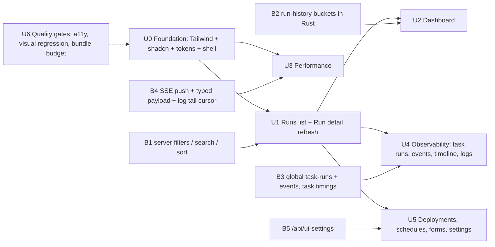

# UI parity roadmap (Prefect 3.8 UI v2 → IronFlow)

**Status:** Accepted design — no code landed yet; each ID below is one branch / PR  
**Date:** 2026-09-07  
**Audience:** Maintainers picking the next frontend / shim sessions  
**Foundation decision (approved):** adopt **Tailwind CSS + shadcn/ui (Radix primitives) + lucide icons**, the same stack Prefect UI v2 uses. This replaces the ad-hoc `frontend/src/styles.css` with a token-based design system; it is a *new major dependency* under `AGENTS.md` → **Ask first**, and that approval is recorded here.

Related: [`prefect-gap-canvas.md`](prefect-gap-canvas.md) (product backlog; UI row was "partial"), [`../ui_prefect_parity_checklist.md`](../ui_prefect_parity_checklist.md) (feature matrix), [`../ui_phase1_api_contract.md`](../ui_phase1_api_contract.md) (run API perf targets), [`north-stars-later.md`](north-stars-later.md) (pixel-perfect clone stays parked).

---

## 1. Where we are (audit 2026-09-07)

Frontend is ~4.1k LOC: React 18 + Vite 5 + TypeScript strict, `react-router-dom` v6, `@tanstack/react-query` v5, Vitest + Testing Library, Playwright e2e (`frontend/e2e/*.spec.ts`). Live updates are an SSE *pulse* (`useSsePulse` → React Query invalidate), workers poll every 15 s.

**Keep (do not rewrite):**

| Piece | Why |
| --- | --- |
| `frontend/src/api.ts` + `types.ts` | Typed client already covers every route the UI needs, plus a few API-ahead methods (`listTasks`, `createDeployment`, `getConcurrencyLimit`) |
| React Query + `useSsePulse` | Sound data layer; only the invalidation granularity changes (U3) |
| Custom SVG DAG (`RunDagPanel`, `dag/*`, `useDagViewport`) | Differentiator (logical / expanded modes, gate + subflow kinds, path highlight); unit-tested. Re-skin with tokens, do not port to Pixi/canvas |
| Playwright specs | Behavioural contract for cancel / pause / retry / DAG / GCL / persist_result; selectors and roles must stay stable through the restyle |

**Gap vs Prefect 3.8 UI v2** (Tailwind + shadcn/ui, TanStack Table, Recharts, Pixi run graph, 5 s polling on active runs, URL-persisted filters):

| Axis | IronFlow today | Prefect UI v2 |
| --- | --- | --- |
| **Aesthetics** | One 516-line global CSS, duplicated hex palette, no CSS variables, dark only, no icons, Inter declared but never loaded, top-bar nav, no `@media` queries, `<p>Loading…</p>` placeholders, `EmptyState` component unused | Token-based light/dark theme, icon sidebar, skeletons, consistent state colour system across badges / charts / graph |
| **Performance** | All pages imported eagerly (no `React.lazy`); Logs (1000) / Task Runs (500) / Events (1000) rendered unvirtualized; SSE pulse invalidates whole lists; backend SSE is a 250 ms poll of `list_flow_runs(limit=1)`; run search is client-side over loaded pages only; no sort params | Route splitting, TanStack Table + virtual lists, targeted refetch on active runs, server-side filters and sort |
| **UX** | No dashboard, no global Task Runs / Events pages, no timeline / Gantt, filters not URL-persisted, no date range, no log follow / tail, no "Copy to new run", raw-JSON parameter editor, no schedule editor, `role`/`aria` sparse, no focus trap on modal, no keyboard shortcuts | Dashboard cards, Flow Runs / Task Runs tabs, Events page, run graph + timeline, filters in URL, log links + follow, copy-to-new-run, forms with validation, keyboard access |

Backend facts that shape the plan (`python-shim/src/prefect_compat/routes/*`, `control_plane/*`):

- All list routes are cursor pages (`items` + `next_cursor`) ordered by `seq DESC`; **no** `sort`, `flow_name`, `deployment_id`, date-range, or text-search params on `GET /api/flow-runs`.
- No global `GET /api/task-runs` or `GET /api/events` (both only nested under a flow run). No history / bucket endpoint.
- Task-run rows expose `created_at` / `updated_at` only — **no** start / end timestamps (only `deployment_runs` has `started_at` / `finished_at`), so a Gantt needs a schema-visible addition (B3).
- SSE `routes/streams.py` polls every 250 ms and emits `data:` only when the payload changes; there is no typed event payload.
- `GET /api/server-info` exists (status + catalog settings); nothing like Prefect's `/ui-settings` (auth mode, flags, version).

---

## 2. Three-expert consensus (repo review protocol)

**Expert A — Product / UX parity.** Users judge an orchestrator UI on three screens: the runs list they live in, the run detail they debug in, and the first paint (dashboard). Restyle + restructure those first; deployments / settings polish comes after. Do not chase pixel parity; chase the *information architecture* (sidebar, tabs with counts, state colours, URL-shareable filters).

**Expert B — Frontend performance.** The cheap wins (lazy routes, virtual lists, skeletons) cost nothing in backend work and should ship inside the foundation. The expensive wins (server-side search / sort, typed SSE push, log tail cursor, history buckets) all need shim / engine changes, so they must be scheduled as *parallel* backend slices one phase ahead of the UI that consumes them, otherwise the frontend session stalls.

**Expert C — Repo governance / Rust-first.** Tailwind + shadcn is approved, but every *new query shape* the UI needs (bucketed run counts, filtered / sorted run lists, global task-run and event lists) is a query-heavy hot path and belongs in `rust-engine/` behind the existing bridge (`_query_rust`), with the FastAPI route staying thin. Hotspot files (`server.py`, `frontend/package.json`, `rust-engine/src/lib.rs`) get a single writer per PR. Vendored shadcn components live under `frontend/src/components/ui/` and count toward the ≤800-line new-file cap individually (they are small).

**Consensus order:** U0 → U1 → U2 → U3 → U4 → U5, with U6 quality gates attached to every PR from U0 on, and backend enablers B1–B5 landed one phase ahead of their UI consumer. Custom SVG DAG stays; Pixi/WebGL port and Storybook are parked.

---

## 3. Phase dependencies



---

## 4. Frontend phases

Ownership: **frontend** unless stated. Every phase: `npm --prefix frontend run build`, `npm --prefix frontend test`, Playwright for touched flows, plus root **Expected Validation** when shim / engine files change.

### U0 — Foundation (1–2 PRs)

| Step | Detail |
| --- | --- |
| Dependencies | `tailwindcss` + `postcss` + `autoprefixer` (dev), `class-variance-authority`, `clsx`, `tailwind-merge`, `lucide-react`, Radix primitives pulled in by the shadcn components actually vendored. `frontend/package.json` + lockfile edited in **this PR only** (hotspot, single writer). |
| Tokens | CSS variables in `frontend/src/styles/tokens.css` (background, surface, border, text, muted, accent, plus a **state palette**: running / completed / failed / cancelled / pending / scheduled / paused / crashed) mapped into `tailwind.config.ts`. Light + dark, system default, persisted toggle (`localStorage`). `StateBadge`, DAG node fills, and (later) chart colours all read the same variables. |
| Typography | Load Inter (self-hosted woff2 under `frontend/public/fonts/`, no CDN) via `index.html`; type scale in tokens. |
| Shell | Rewrite `AppShell`: left icon sidebar (Dashboard placeholder → `/runs` until U2, Flow Runs, Flows, Deployments, Work Pools, Concurrency), top bar with theme toggle and server status dot from `/health`, content well `max-w-screen-2xl`. Collapses to icon rail ≤1024 px, drawer ≤768 px. |
| Primitives | Vendor shadcn: Button, Badge, Card, Table, Tabs, Dialog (focus trap fixes the `QuickRunModal` a11y gap), DropdownMenu, Tooltip, Skeleton, Input, Select, Separator, Toast. Wrap existing `DataTable`, `TabBar`, `PageHeader`, `ErrorBanner`, `EmptyState` (currently unused — wire it) on top of them so page code changes minimally. |
| Perf freebies | `React.lazy` + `Suspense` per route in `App.tsx`; `frontend/scripts/bundle-budget.mjs` reads `dist/` and fails `npm run build` when initial JS (gz) exceeds the recorded budget (`frontend/bundle-budget.json`). |
| Migration rule | Restyle page by page; delete `styles.css` at the end of U1. Keep Playwright roles / text selectors stable (`getByRole('tab', …)`, button labels). |
| Acceptance | Existing Vitest + Playwright green; light + dark screenshots of Runs and Run detail added to `docs/ui_e2e_visual_check.md`; `frontend/AGENTS.md` replaces "do not invent a new design system" with "use tokens in `styles/tokens.css` and primitives in `components/ui/`". |

### U1 — Runs list and Run detail refresh (frontend + B1)

- **Runs list on TanStack Table** (`@tanstack/react-table`): sortable columns (state, name, flow, start, duration, updated), column visibility, sticky header, compact / comfortable density.
- **Filters in the URL** (`useSearchParams`): state multi-select, flow, deployment, date range with Prefect-style presets (past hour / day / 7 days / custom, typed dates allowed), text search. Server-side search + sort from **B1** replaces the client-side `filtered` memo in `RunsPage.tsx`. Cursor pagination stays ("Load more" or infinite scroll).
- **Row parity:** state badge with icon, flow + deployment links, start time + humanised duration, subflow context, tags placeholder column (hidden until tags exist).
- **Run detail restructure:** header (state, timings created / started / ended / duration, deployment link, breadcrumb), parameters card, action menu (Cancel, Pause drain | terminate chooser, Resume, Retry, **Copy to new run** — deployment-backed runs re-trigger `triggerDeploymentRun` with the stored parameters prefilled in the run dialog), tabs with counts (Task Runs, Logs, Events, Artifacts, DAG). Split `pages/RunDetailPage.tsx` (428 lines) into `pages/run-detail/{Header,Actions,TaskRunsTab,LogsTab,EventsTab,ArtifactsTab}.tsx`.
- **Acceptance:** filters survive reload and are shareable; sort is server-backed (network shows `sort=`); new Playwright specs for URL filters and copy-to-new-run; `run-actions`, `lifecycle-pause`, `cancel-retry-workflow` specs unchanged and green.

### U2 — Dashboard (frontend + B2)

- `/dashboard` is the new default route (`/` redirects there; `/runs` keeps working).
- Cards: **Flow Runs** (Recharts stacked bar by state over the selected window, each bar click-through to `/runs?state=…&from=…&to=…`), **Task Runs** stats (counts by state), **Work Pools** health (online / offline workers from heartbeats, paused pools), **Recent failures** (last N `FAILED` / `CRASHED` runs), **Upcoming** (deployments ordered by `schedule_next_run_at`).
- Add `recharts` in this PR (single `package.json` writer).
- **Acceptance:** dashboard renders from `scripts/ui_e2e_seed.py` data; empty state when no runs; Playwright smoke; history endpoint p95 recorded in `docs/ui_phase1_api_contract.md`.

### U3 — Performance (frontend + B4)

- **Virtual lists:** `@tanstack/react-virtual` for Logs, Task Runs, Events tabs. Target: smooth scroll (no dropped frames in DevTools performance trace) at 10k log lines.
- **Log tail:** use the B4 `since` cursor to append new rows in a **Follow** mode instead of refetching up to 1000 rows on every pulse; level colour coding; clickable URLs; copy line / copy all.
- **Targeted SSE:** consume B4 typed payloads (`{type, flow_run_id, state, seq}`) — `setQueryData` for the run row / detail, invalidate only the affected tab queries; keep the pulse fallback for unknown types. Reconnect with exponential backoff and a "reconnecting" indicator (Prefect 3.8 "run watch survives reconnects").
- **React Query policy:** `refetchInterval` only while the run is `RUNNING` / `PENDING` / `PAUSED`; explicit `staleTime` per resource (runs 5 s, catalog 30 s, workers 15 s); `refetchOnWindowFocus` for entity lists.
- **DAG:** viewport culling (skip nodes / edges outside the visible rect) and label level-of-detail above ~300 nodes; memoise edge paths per layout. Stay on SVG; revisit canvas only if the expanded cap (600 nodes / 2000 edges) becomes a real workload.
- **Acceptance:** before / after table appended to this file (initial JS gz, log-scroll trace, SSE messages per run transition); `benchmarks/perf_matrix.py run --preset lite` shows no control-plane regression (revert tracked `docs/perf_matrix_*` outputs unless intended).

### U4 — Observability UX (frontend + B3)

- `/runs` gains **Flow Runs | Task Runs** tabs (global task-run list from B3 with state / flow / task-name filters in the URL).
- `/events` page: chronological list with resource / type filters, URL persistence, link into the run.
- Run detail **Timeline** tab: Gantt of task runs from B3 `started_at` / `ended_at`, same state colours as DAG and badges, click to select the node in the DAG tab.
- **Artifacts / result explorer** (canvas P5.3 tie-in): collapsible JSON viewer, copy, download as `.json`.
- **Keyboard:** `/` focuses search, `g d` / `g r` / `g f` navigate, `Esc` closes dialogs; optional command palette (shadcn `Command`) once routes stabilise.

### U5 — Deployments, schedules, forms, settings (frontend + B5)

- Deployment detail tabs (Runs, Parameters, Schedule). **Schedule editor** for interval / cron / RRule subset with next-runs preview (computed from `schedule_next_run_at` + server preview when available).
- **Run form** with `react-hook-form` + `zod` replacing raw JSON in `QuickRunModal` (JSON stays as an "advanced" toggle). Forms take default values once per entity (`key={deployment.id}`) so refetches do not clobber in-flight edits.
- Work pool detail: worker freshness (heartbeat age), pause / resume, deployments bound to the pool.
- **Settings / Server** page from B5 `/api/ui-settings` + `/api/server-info`: version, auth mode, storage backend, enabled flags; groundwork for the login UI in [`self-hosted-docker-auth.md`](self-hosted-docker-auth.md).

### U6 — Quality gates (continuous, attached to every PR from U0)

- Playwright `@axe-core/playwright` scan on Runs, Run detail, Dashboard, Deployments (no serious / critical violations).
- Visual regression screenshots (light + dark) for the same pages via `toHaveScreenshot`, committed under `frontend/e2e/__screenshots__/`.
- Bundle budget enforced in `npm run build` (from U0) and surfaced in CI once the frontend workflow exists (**CI edits are Ask-first** — file as a separate infra task).
- Vitest for component wrappers only where there is logic (state → colour mapping, filter ↔ URL serialisation, duration formatting).
- Docs per phase: tick / add rows in `docs/ui_prefect_parity_checklist.md`, recapture README screenshots (`docs/ui_e2e_visual_check.md`), keep `docs/how-to/server-and-ui.md` current.

---

## 5. Backend enablers (python-shim + rust-engine)

Ownership: **shim + engine**. Rule from Expert C: new query shapes go into `rust-engine` and are exposed through the existing bridge; FastAPI routes stay thin and keep the `CursorPage` contract. Each is one PR; land one phase ahead of the consuming UI slice.

| ID | Endpoint / change | Consumer | Acceptance |
| --- | --- | --- | --- |
| **B1** | `GET /api/flow-runs`: add `flow_name`, `deployment_id`, `created_after` / `created_before`, `q` (name substring), `sort` (`created_at` / `updated_at` / `name` / `state`, `asc` / `desc`); cursor semantics preserved per sort key | U1 | Rust query path handles all params; Python fallback parity test; index review (`idx_flow_runs_state_created`); p95 within `docs/ui_phase1_api_contract.md` targets |
| **B2** | `GET /api/flow-runs/history?from=&to=&bucket=` → `[{bucket_start, counts_by_state}]`; `GET /api/task-runs/summary` → counts by state | U2 | Implemented as Rust aggregate over the read model; deterministic bucket edges; unit tests on bucket boundaries; perf_matrix lite unchanged |
| **B3** | Global `GET /api/task-runs` (filters: `state`, `flow_name`, `task_name`, cursor) and `GET /api/events` (filters: `resource`, `type`, cursor); add `started_at` / `ended_at` to task-run rows (derived at `RUNNING` entry and terminal transition; JSONL + SQLite + Postgres projections) | U4 | Schema change is **Ask-first** → own PR with migration note; task rows expose timings; COMPATIBILITY note for events surface |
| **B4** | SSE emits from the write path (publish on state transition / log append) instead of the 250 ms poll; typed payload `{type, flow_run_id, task_run_id?, state?, seq}`; `GET …/logs?since=<seq>` for tail | U3 | Streams stay `text/event-stream`; heartbeat comment every 15 s; reconnect-safe (`Last-Event-ID`); unit test for fan-out to N subscribers; no control-plane lock held while emitting |
| **B5** | `GET /api/ui-settings` → `{version, auth: "BASIC" \| null, storage_backend, flags[]}` (mirrors Prefect's `/ui-settings` shape) | U5 | Served unauthenticated (UI needs it before login); reads `VERSION`; test + docs in `docs/SELF_HOSTED_SERVER.md` |

---

## 6. Explicit non-goals / parked

- Pixel-perfect Prefect clone (stays in `north-stars-later.md` and canvas P8)
- Prefect Cloud auth / workspaces / RBAC
- Blocks / Variables UI until canvas **P6.1** exists; Automations UI until **P7**
- Work-queue UI (no work-queue model)
- Pixi / WebGL run-graph port (SVG + culling first)
- Storybook (revisit after U2 if component count warrants it)

---

## 7. Session queue (copy into task briefs)

```text
U0  feat/frontend-design-system-foundation
B1  feat/python-shim-flow-run-filters-sort        (Rust query in rust-engine)
U1  feat/frontend-runs-and-run-detail
B2  feat/rust-engine-run-history-buckets
U2  feat/frontend-dashboard
B4  feat/python-shim-sse-push-and-log-tail
U3  feat/frontend-performance
B3  feat/python-shim-global-task-runs-events      (schema change: Ask-first)
U4  feat/frontend-observability
B5  feat/python-shim-ui-settings
U5  feat/frontend-deployments-forms-settings
U6  attach to every PR above (axe, screenshots, budget, checklist tick)
```

Each brief must cite this file and one ID, name the owned paths (frontend vs shim vs engine), list forbidden hotspots for that PR, and restate the acceptance row above. Update **Status** at the top of this file as IDs land, and mirror the outcome in `docs/ui_prefect_parity_checklist.md` and `docs/MEMORY_BANK.md`.
